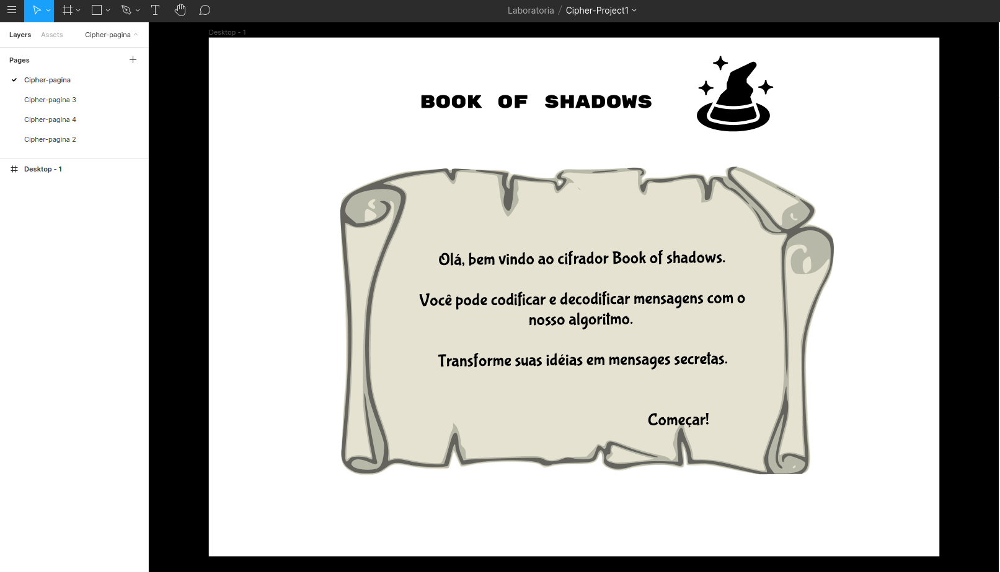

## Aplicação e sua funcionalidade
A aplicação é destinada para cifrar e decifrar uma mensagem utilizando o método "Cifra de César". Uma  forma simples de criptografia por substituição, cada letra do texto é substituida por outra letra. O nome é em homenagem á Julio César, que usava essa criptografia para se comunicar com seus generais.
O alfabeto cifrado é o alfabeto normal deslocado à direita ou esquerda por um número de posições que é escolhida pelo usuário, serão cifradas dessa forma apenas as letras do alfabeto digitadas em Caixa Alta(CapsLocK ativado), por exemplo:

Normal: ABCDEFGHIJKLMNOPQRSTUVWXYZ

Cifrado: DEFGHIJKLMNOPQRSTUVWXYZABC

Os outros caracteres, tal como letras minúsculas, serão cifrados, porém utilizando o deslocamento inputado pelo usuário(Nesse exemplo usamos 9) dentro da tabela ASC II, por exemplo: 

Normal:MEU NOME E CAMILA MONREAL. QUAL O SEU NOME?

Cifrado:VND)WXVN)P)LJVRUJ)VXWANJU7)ZDJU)X)BND)WXVNH
                  :point_down:            
Quando a pessoa for decifrar essa mensagem, com caracteres fora do alfabeto em caixa alta, acontecerá isso:

Decifrado: MEUTNOMETETCAMILATMONREALHTQUALTOTSEUTNOMEY

***
# Cifra de César - Book Of Shadows
Book of Shadows é uma aplicação voltada aos estudantes e simpatizantes de Ocultismo. Livro das sombras (BOS - Book of Shadows)da terminologia Wicca, é utilizado para os praticantes do ocultismo anotar descobertas e práticas. 
A nossa aplicação ajudará a cifrar as anotações para o usuário escrever em seu livro, fazendo com que apenas o dono de seu BOS saiba o que escreveu, ele poderá fornecer o deslocamento selecionado e o link da aplicação, se quiser, para outra pessoa entender as anotações em seu livro pessoal.

*** 
# Definições de Produto 
Para chegar as definições finais do produto e se ele atenderia o público:
* Pesquisei em lojas de aplicativos de celulares, e na internet se alguma aplicação, voltada para o público ocultista, fornecia essa opção de cifragem e decifragem para copiar para um BOS. Conclui que não existe nenhuma aplicação. 
* Pesquisei aplicativos e páginas na Web de ferramentas para ocultistas para coletar idéias de funcionalidades e visual. Concluindo que era importante colocar um pergaminho ao fundo, simulando a escrita em um pergaminho mediaeval; Foram colocados também dois simbolos para enfeite da página, um pentagrama invertido simbolizando o oculto e outra de números binários simbolizando codificação; O chapéu ao início do lado esquerdo do nome da aplicação, representa o usuário (O bruxo, o ocultista). Todos esses aspectos passam uma mensagem final, essa mensagem visual final deixa claro o público alvo e a sensação de escrever em um pergaminho antigo e em um passe de mágica cifrar e decifrar a mensagem. 

A interface do usuário foi definida através da história de usuário:
 * Na página inicial ler a descrição no pergaminho; 
 * Clicar em César chipher para começar a cifrar ou decifrar; 
 * Na segunda página ler a mensagem "Input a message and a secret number to code";
 * Imputar a mensagem que quer cifrar;
 * Imputar o número de deslocamento, chamado de "Secret number";
 * Escolher entre Encode ou Decode, e clicar  em um dos dois botões, cada um faz uma funcão; 
 * A mensagem aparecerá na mesma caixa de input que o usuário inseriu a mensagem, ele poderá copiar e colar onde ele quiser, ou copiar em um papel á mão; 
* Próximo aos botões de Encode e Decode estará um atalho para voltar para a tela inicial, chamado de "Home".

O protótipo de tela foi feito utilizando a ferramenta Figma. E o protótipo inicial foi o da imagem abaixo (Imagem capturada na página da ferramenta Figma): 

  

***

# Deploy, instação e Dependências
* Instale o Node.js;
* Faça um fork no Github;
* Clone o fork para seu computador (cópia local);
* Instale as dependências: npm install (No terminal);
* Para atualizar seu projeto localmente e no github acesse o tutorial da [Rails Girls](http://guides.railsgirls.com/guides-ptbr/github);
* Para execultar os testes: npm test (No terminal);
* Para ver a interface do seu programa no navegador, use o comando npm start(No terminal) para iniciar o servidor web e entre na url http://localhost:5000 no seu navegador.
* Se quiser pode hospedar no [Github Pages](https://pages.github.com/), ativando na aba de configurações do seu fork no Github;

***

# Considerações
Nas linhas 56 até 60 do arquivo "cipher.spec.js" os comandos para execução do teste decode estavam incorretos, eles chamavam cipher.encode ao invés de cipher.decode. Modifiquei, acertando para cipher.decode